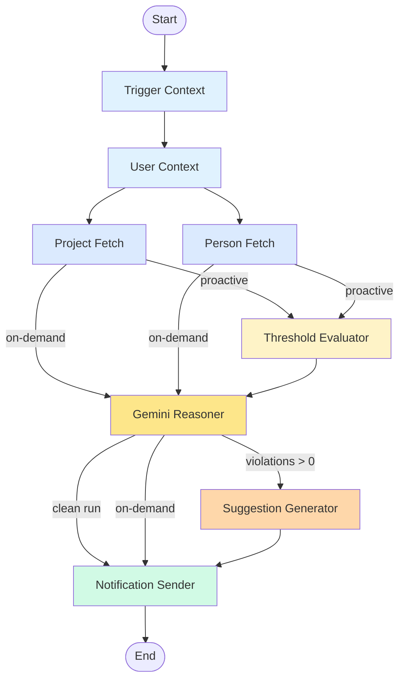

# FleetGraph — Ship's AI Graph Agent

FleetGraph is an AI-powered project health monitor that proactively detects problems in Ship workspaces and provides on-demand analysis. It uses a LangGraph state graph with Gemini 2.5 Flash reasoning, deterministic threshold evaluation, and a human-in-the-loop suggestion queue.

## Agent Responsibility

FleetGraph monitors Ship projects for conditions that indicate risk:

- **Priority overload**: A project has too many high-priority issues (>7) or medium-priority issues (>10), indicating poor prioritization or scope creep.
- **In-progress overload**: A project has too many items in progress (>5), suggesting WIP limits are being violated.
- **Person overload**: An individual has too many high-priority items across all their projects (>2 high, >3 medium), indicating workload imbalance.
- **Staleness**: An issue hasn't been updated within its priority-based threshold (>2 days for high, >5 for medium, >30 for low).

The agent is allowed to **suggest** changes (priority, status, reassignment) but never executes them without human approval. Every suggestion lands in an action queue where the user can approve, dismiss, or snooze it.

The agent authenticates as a service account (`agent@ship.internal`) with a long-lived bearer token. It runs as a separate process from the Ship API, communicating via HTTP and WebSocket.

## Use Cases

| # | Role | Trigger | Detection | Human Decision |
|---|------|---------|-----------|----------------|
| 1 | Director | Morning scan | Projects with priority inflation (>7 high), overloaded individuals (>2 high across all work), stale high-priority items across the org | Escalate, reassign across teams, or adjust scope |
| 2 | PM | Project-level changes | Project health: too many in-progress (>5), priority skew, retro readiness, empty project needing planning | Approve priority changes, confirm retro, greenlight issue breakdown |
| 3 | Engineer | Assignment/staleness on own issues | "You have a high-priority issue with no update in 2 days", "3 items in-progress — consider finishing one" | Update status, reprioritize, or push back on load |
| 4 | All | Daily scheduled run | Overnight changes, approaching staleness, retros ready for completion | Review briefing, approve/dismiss suggested actions |
| 5 | PM/Director | Pattern detection | Orphaned issues without a parent project, clusters of related work worth organizing | Conversation about impact/complexity, approve project creation |
| 6 | Engineer/Manager | On-demand (coach) | "You tend to underestimate high-priority items", "3 consecutive weeks with carryover" | Adjust behavior, have conversation with report, dismiss |
| 7 | PM | Week end | Empty retro with completed issues available for drafting | Review draft, edit, confirm completion |
| 8 | PM/Director | On-demand (resource view) | Workload imbalance: "Move AUTH-42 from Alice to Frank — Alice has 3 high-priority, Frank has capacity" | Approve or reject each suggested reassignment |

## Graph Architecture

### Graph Diagram



### Node Descriptions

| Node | Type | Description |
|------|------|-------------|
| Trigger Context | Context | Extracts trigger metadata: event payload, schedule type, or on-demand question |
| User Context | Context | Resolves target user and their role (director/pm/engineer) |
| Project Fetch | Fetch | Retrieves project + issues from Ship API via `ShipClient` |
| Person Fetch | Fetch | Retrieves all issues assigned to the target user |
| Threshold Evaluator | Reasoning | Deterministic math — checks all thresholds, outputs violations list. No Gemini. |
| Gemini Reasoner | Reasoning | Always runs. Clean runs get health summary; violation runs get deep analysis; on-demand answers the user's question. Uses `gemini-2.5-flash`. |
| Suggestion Generator | Action | Maps violations to concrete actions deterministically. Gemini provides explanation text, not the action itself. |
| Notification Sender | Output | Persists suggestions to `agent_actions` table via Ship API |

### Conditional Edges

1. **After User Context → Fetch**: Both project and person fetch run in parallel (LangGraph fan-out).
2. **After Fetch → Threshold or Gemini**: Proactive runs go through Threshold Evaluator first. On-demand runs skip directly to Gemini Reasoner.
3. **After Gemini → Suggestion or Notification**: If violations exist, Suggestion Generator creates pending actions. If clean, only a summary notification is sent. On-demand skips suggestions entirely.

### Execution Paths

**Proactive Clean Run:**
`Trigger → User → [Project Fetch ∥ Person Fetch] → Threshold (0 violations) → Gemini (PROACTIVE_CLEAN) → Notification`

**Proactive Violation Run:**
`Trigger → User → [Project Fetch ∥ Person Fetch] → Threshold (violations) → Gemini (PROACTIVE_VIOLATIONS) → Suggestion Generator → Notification`

**On-Demand Chat:**
`Trigger → User → [Project Fetch ∥ Person Fetch] → Gemini (ON_DEMAND) → Notification`

## Trigger Model

FleetGraph uses a **hybrid trigger model** combining event-driven and scheduled approaches:

### Event-Driven (Webhook-style)
When a document mutation hits the Ship API (issue created, priority changed, status updated), the API broadcasts an `issue:created` or `issue:updated` event via the `/events` WebSocket. The agent's EventListener receives these events and triggers a graph run.

**Debouncing**: A 30-second window per project batches rapid mutations (e.g., a PM cleaning up a board) into a single graph run. If multiple events fire for the same project within 30 seconds, only one evaluation occurs.

**Latency**: Detection happens within seconds of the triggering change + the 30-second debounce window. Well under the 5-minute detection goal.

### Scheduled (Poll)
- **Morning briefing** (daily): Scans all projects, generates per-user briefings, queues suggested actions.
- **Staleness cron** (hourly): Scans for issues that have aged past their update thresholds. The absence of an update never triggers a webhook, so staleness detection requires a scheduled tick.

### Why Hybrid?
Pure polling would mean scanning all projects every N minutes looking for changes you already know about at write time — wasteful. Pure webhooks miss time-based triggers and can't detect the absence of events (staleness). The hybrid approach gives immediate detection for mutations and scheduled detection for time-based conditions.

### Cost at Scale
Event-driven cost scales with write volume, not project count. Gemini calls happen only for morning briefings (~1/user/day), on-demand requests, and violation analysis — not on every document change. The threshold checks are deterministic math with no API call overhead. At 100 projects (~20 users): negligible. At 1,000 projects (~200 users): manageable. At 10,000: infrastructure scaling needed for the worker process, but no architecture redesign.

## LangSmith Traces

All graph runs are traced via LangSmith with metadata: `trigger_type`, `project_id`, `target_user_id`, `run_id`.

### Trace 1: Clean Run
- **Project**: Taxpayer Digital Experience (healthy, 6 issues, no threshold violations)
- **Path**: Trigger → User → Fetch → Threshold (0 violations) → Gemini (PROACTIVE_CLEAN) → Notification
- **Gemini output**: Short health summary confirming project is on track

### Trace 2: Violation Run
- **Project**: Direct File — Free Filing Platform (9 high-priority issues, exceeds >7 threshold)
- **Path**: Trigger → User → Fetch → Threshold (priority_overload violation) → Gemini (PROACTIVE_VIOLATIONS) → Suggestion Generator → Notification
- **Gemini output**: Detailed analysis of priority overload with root cause and recommendation

### Trace 3: On-Demand Chat
- **Question**: "What are the biggest risks on this project?"
- **Project**: Direct File — Free Filing Platform
- **Path**: Trigger → User → Fetch → Gemini (ON_DEMAND) → Notification
- **Gemini output**: Risk analysis referencing specific issue IDs, assignees, and priority distribution

## Technology Stack

| Component | Technology |
|-----------|-----------|
| Graph framework | LangGraph (`@langchain/langgraph`) |
| AI reasoning | Gemini 2.5 Flash (`@google/generative-ai`) |
| Tracing | LangSmith (`langsmith`) |
| Agent server | Express (port 3001) |
| Ship communication | HTTP (REST API) + WebSocket (`/events`) |
| Persistence | PostgreSQL (`agent_actions` table) |
| Frontend | React chat panel + action queue |

## Agent Actions Schema

```sql
CREATE TABLE agent_actions (
  id UUID PRIMARY KEY DEFAULT gen_random_uuid(),
  workspace_id UUID NOT NULL REFERENCES workspaces(id),
  target_user_id UUID NOT NULL REFERENCES users(id),
  action_type VARCHAR(50) NOT NULL,
  status VARCHAR(20) NOT NULL DEFAULT 'pending',
  severity_score NUMERIC,
  context JSONB NOT NULL,
  suggestion JSONB NOT NULL,
  gemini_reasoning TEXT,
  snooze_until TIMESTAMPTZ,
  resolved_at TIMESTAMPTZ,
  langsmith_trace_id VARCHAR(100),
  created_at TIMESTAMPTZ DEFAULT NOW(),
  updated_at TIMESTAMPTZ DEFAULT NOW()
);
```

## Test Coverage

| Test File | Tests | What it covers |
|-----------|-------|---------------|
| thresholds.test.ts | 19 | All threshold types: priority overload, in-progress, person overload, staleness, custom configs, severity scoring |
| suggestion-generator.test.ts | 7 | Violation-to-suggestion mapping for all 4 violation types, target_user_id fallback |
| event-listener.test.ts | 7 | Debounce timing, multi-project batching, cleanup, default 30s window |
| graph-nodes.test.ts | 8 | Individual node behavior: trigger context, user context, threshold evaluator |
| graph-integration.test.ts | 6 | Full graph execution: clean run, violation run, on-demand, Gemini failure, API failure |
| ship-client.test.ts | 7 | HTTP client: auth headers, 5xx retry with backoff, 4xx no-retry, response parsing |
| ship-client-live.test.ts | 3 | Live API: bearer token auth, project filter, invalid token rejection |
| suggestions-api.test.ts | 5 | Live CRUD: create/dismiss/reject invalid/reject unauthed |
| on-demand.test.ts | 3 | SSE streaming: token format, context-aware project fetching, 400 on missing question |
| server.test.ts | 1 | Health endpoint response |
| migration.test.ts | 6 | Schema validation: columns, types, indexes, foreign keys, defaults |
| scheduler.test.ts | 7 | Morning briefing creation, staleness detection, skip fresh issues, error resilience, interval firing |
| fetch-nodes.test.ts | 10 | ProgramFetch (parallel projects, partial failure), HistoryFetch (user actions), RetroFetch (completed/carryover split) |
| gemini-modes.test.ts | 9 | All 8 Gemini modes: PROACTIVE_CLEAN/VIOLATIONS, ON_DEMAND, DIRECTOR_OVERVIEW, COACH, LOAD_BALANCER, PROJECT_KICKOFF, RETRO_DRAFT, fallback |
| suggestion-lifecycle.test.ts | 7 | Snooze expiry archival, active snooze skip, 7-day pending expiry, duplicate detection, error tolerance |
| **Total** | **105** | |

## Cost Analysis

### Token Budget per Invocation

| Invocation Type | Input Tokens | Output Tokens | Frequency |
|----------------|-------------|--------------|-----------|
| Clean run (no violations) | ~1-2k | ~200-500 | Per event, most common |
| Violation run | ~2-3k | ~500-1k | Per triggered project |
| Morning briefing | ~2-3k | ~500-1k | 1 per user per day |
| Retro draft | ~3-5k | ~1-2k | 1 per retro |
| Coach insight | ~3-5k | ~500-1k | On-demand only |
| On-demand chat | ~2-3k | ~500-1k | User-initiated |
| Load balancer | ~2-3k | ~500-1k | On-demand only |
| Project kickoff | ~2-3k | ~2-3k | Rare |

### Cost at Scale

| Scale | Users | Gemini Calls/Day | Estimated Cost/Day |
|-------|-------|-----------------|-------------------|
| 100 projects | ~20 | ~25 (20 briefings + 5 on-demand) | < $0.10 |
| 1,000 projects | ~200 | ~250 (200 briefings + 50 on-demand) | < $1.00 |
| 10,000 projects | ~2,000 | ~2,500 (2,000 briefings + 500 on-demand) | < $10.00 |

**Cost cliffs**: User count (not project count) is the primary driver. Morning briefings scale linearly with users. On-demand costs scale with engagement. Event-driven threshold checks are deterministic math with zero Gemini cost — only violation analysis triggers a Gemini call.

**Mitigation**: Daily cap of 5 coach interactions per user. 30-second debounce per project prevents event storms. Gemini 2.5 Flash pricing makes even 10,000-user scale economical.

## Error Handling & Degradation

| Scenario | Behavior |
|----------|----------|
| Gemini unavailable | Falls back to structured templated alerts from threshold violations. No natural language, but violations still surface. |
| Ship API down | Retry with exponential backoff (3 attempts). On total failure, mark run as failed, wait for next trigger. No partial actions. |
| Partial fetch failure | Graph continues with available data. If Project Fetch fails but Person Fetch succeeds, threshold evaluator runs with person data only. |
| Agent process crash | Docker health check restarts it. Suggestions already written to `agent_actions` are unaffected — they live in Ship's database. |
| WebSocket disconnect | Agent auto-reconnects with 5-second backoff. Events during disconnect are missed but next scheduled run catches up. |
