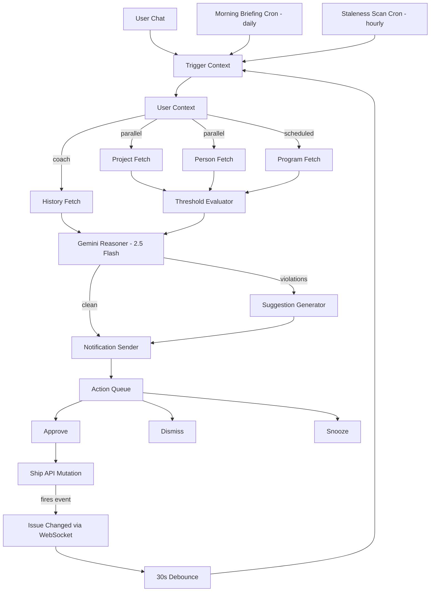

# FleetGraph — Ship's AI Graph Agent

FleetGraph is an AI-powered project health monitor that proactively detects problems in Ship workspaces and provides on-demand analysis. It uses a LangGraph state graph with Gemini 2.5 Flash reasoning, deterministic threshold evaluation, and a human-in-the-loop suggestion queue.

## Agent Responsibility

FleetGraph monitors Ship projects for conditions that indicate risk:

- **Priority overload**: A project has too many high-priority issues (>7) or medium-priority issues (>10), indicating poor prioritization or scope creep.
- **In-progress overload**: A project has too many items in progress (>5), suggesting WIP limits are being violated.
- **Person overload**: An individual has too many high-priority items across all their projects (>2 high, >3 medium), indicating workload imbalance.
- **Staleness**: An issue hasn't been updated within its priority-based threshold (>2 days for high, >5 for medium, >30 for low).

The agent is allowed to **suggest** changes (priority, status, reassignment) but never executes them without human approval. Every suggestion lands in an action queue where the user can approve, dismiss, or snooze it.

The agent authenticates as a service account (`agent@ship.internal`) with a long-lived bearer token. It runs as a separate process from the Ship API, communicating via HTTP and WebSocket.

## Use Cases

| # | Role | Trigger | Detection | Human Decision |
|---|------|---------|-----------|----------------|
| 1 | Director | Morning scan | Projects with priority inflation (>7 high), overloaded individuals (>2 high across all work), stale high-priority items across the org | Escalate, reassign across teams, or adjust scope |
| 2 | PM | Project-level changes | Project health: too many in-progress (>5), priority skew, retro readiness, empty project needing planning | Approve priority changes, confirm retro, greenlight issue breakdown |
| 3 | Engineer | Assignment/staleness on own issues | "You have a high-priority issue with no update in 2 days", "3 items in-progress — consider finishing one" | Update status, reprioritize, or push back on load |
| 4 | All | Daily scheduled run | Overnight changes, approaching staleness, retros ready for completion | Review briefing, approve/dismiss suggested actions |
| 5 | PM/Director | Pattern detection | Orphaned issues without a parent project, clusters of related work worth organizing | Conversation about impact/complexity, approve project creation |
| 6 | Engineer/Manager | On-demand (coach) | "You tend to underestimate high-priority items", "3 consecutive weeks with carryover" | Adjust behavior, have conversation with report, dismiss |
| 7 | PM | Week end | Empty retro with completed issues available for drafting | Review draft, edit, confirm completion |
| 8 | PM/Director | On-demand (resource view) | Workload imbalance: "Move AUTH-42 from Alice to Frank — Alice has 3 high-priority, Frank has capacity" | Approve or reject each suggested reassignment |

## Graph Architecture

### Graph Diagram



### Node Inventory (11 nodes)

| Node | Type | Description |
|------|------|-------------|
| Trigger Context | Context | Extracts trigger metadata: event payload, schedule type, or on-demand question |
| User Context | Context | Resolves target user and their role (director/pm/engineer) |
| Project Fetch | Fetch | Retrieves project + issues from Ship API via `ShipClient` |
| Person Fetch | Fetch | Retrieves all issues assigned to the target user |
| Program Fetch | Fetch | Retrieves all programs and projects for director overview |
| History Fetch | Fetch | Retrieves past agent_actions for coach pattern detection |
| Retro Fetch | Fetch | Splits project issues into completed vs carryover for retro drafts |
| Threshold Evaluator | Reasoning | Deterministic math — checks all thresholds, outputs violations list. No Gemini. |
| Gemini Reasoner | Reasoning | Always runs (8 prompt modes). Clean runs get health summary; violation runs get deep analysis; on-demand answers the user's question. Uses `gemini-2.5-flash`. |
| Suggestion Generator | Action | Maps violations to concrete actions deterministically. Gemini provides explanation text, not the action itself. |
| Notification Sender | Output | Persists suggestions to `agent_actions` table via Ship API + WebSocket push |

### Conditional Edges

1. **After User Context → Fetch**: Fetch nodes run in parallel (LangGraph fan-out). Event/scheduled runs fetch project + person. Scheduled also fetches programs. Coach questions fetch person + history.
2. **After Fetch → Threshold or Gemini**: Proactive and command runs go through Threshold Evaluator first. Pure on-demand chat skips directly to Gemini Reasoner.
3. **After Gemini → Suggestion or Notification**: If violations exist, Suggestion Generator creates pending actions. If clean, only a summary notification is sent.

### Execution Paths

**Proactive Clean Run:**
`Trigger → User → [Project Fetch ∥ Person Fetch] → Threshold (0 violations) → Gemini (PROACTIVE_CLEAN) → Notification`

**Proactive Violation Run:**
`Trigger → User → [Project Fetch ∥ Person Fetch] → Threshold (violations) → Gemini (PROACTIVE_VIOLATIONS) → Suggestion Generator → Notification`

**On-Demand Chat:**
`Trigger → User → [Project Fetch ∥ Person Fetch] → Gemini (ON_DEMAND) → Notification`

**On-Demand Command (health check, stale scan):**
`Trigger → User → [Project Fetch ∥ Person Fetch] → Threshold → Gemini → Suggestion Generator → Notification`

**Director Overview (scheduled):**
`Trigger → User → [Project Fetch ∥ Person Fetch ∥ Program Fetch] → Threshold → Gemini (DIRECTOR_OVERVIEW) → Notification`

**Coach (on-demand):**
`Trigger → User → [Person Fetch ∥ History Fetch] → Gemini (COACH) → Notification`

## Human-in-the-Loop

Every data mutation requires human approval. The agent suggests, the human decides.

### Implemented HITL Loop: Priority Change Approval

1. **Detection**: The Threshold Evaluator finds "Direct File" has 9 high-priority issues (threshold: 7). This produces a `priority_overload` violation with severity 12.
2. **Suggestion**: The Suggestion Generator maps the violation to a concrete action: demote the last high-priority issue from `high` to `medium`. Gemini provides the reasoning text explaining why.
3. **Persistence**: The Notification Sender writes the suggestion to the `agent_actions` table with `status: 'pending'` and pushes a WebSocket notification to the target user.
4. **User sees it**: The Action Queue UI shows a card: "Change priority: high → medium" with the Gemini explanation and three buttons: Approve, Dismiss, Snooze.
5. **Approve**: User clicks Approve. The Ship API executes `PATCH /api/issues/:id` setting `priority: 'medium'`. The suggestion status is updated to `approved` with `resolved_at` timestamp.
6. **Loop re-entry**: The PATCH fires an `issue:updated` WebSocket event. After the 30-second debounce, the agent re-evaluates "Direct File" — now 8 high-priority issues, still over threshold. A new suggestion is generated for the next candidate.
7. **Dismiss/Snooze alternatives**: If the user dismisses, the suggestion is archived and won't resurface unless the count worsens. If snoozed for 24h, the hourly lifecycle cron re-evaluates after expiry — if the condition worsened, a new suggestion appears; if the same or better, it's silently archived.

### What requires approval

| Action | Requires Approval |
|--------|:-:|
| Change issue priority | Yes |
| Change issue status | Yes |
| Reassign issue | Yes |
| Morning briefing (read-only) | No |
| Coach observation (read-only) | No |
| Retro draft (user edits before confirming) | Yes |

## Trigger Model

FleetGraph uses a **hybrid trigger model** combining event-driven and scheduled approaches:

### Event-Driven (Webhook-style)
When a document mutation hits the Ship API (issue created, priority changed, status updated), the API broadcasts an `issue:created` or `issue:updated` event via the `/events` WebSocket. The agent's EventListener receives these events and triggers a graph run.

**Debouncing**: A 30-second window per project batches rapid mutations (e.g., a PM cleaning up a board) into a single graph run. If multiple events fire for the same project within 30 seconds, only one evaluation occurs.

**Latency**: Detection happens within seconds of the triggering change + the 30-second debounce window. Well under the 5-minute detection goal.

### Scheduled (Poll)
- **Morning briefing** (daily): Scans all projects, generates per-user briefings, queues suggested actions.
- **Staleness cron** (hourly): Scans for issues that have aged past their update thresholds. The absence of an update never triggers a webhook, so staleness detection requires a scheduled tick.

### Why Hybrid?
Pure polling would mean scanning all projects every N minutes looking for changes you already know about at write time — wasteful. Pure webhooks miss time-based triggers and can't detect the absence of events (staleness). The hybrid approach gives immediate detection for mutations and scheduled detection for time-based conditions.

### Cost at Scale
Event-driven cost scales with write volume, not project count. Gemini calls happen only for morning briefings (~1/user/day), on-demand requests, and violation analysis — not on every document change. The threshold checks are deterministic math with no API call overhead. At 100 projects (~20 users): negligible. At 1,000 projects (~200 users): manageable. At 10,000: infrastructure scaling needed for the worker process, but no architecture redesign.

## LangSmith Traces

All graph runs are traced via LangSmith with metadata: `trigger_type`, `project_id`, `target_user_id`, `run_id`.

### Shared Trace Links

**Violation Path** (proactive — thresholds triggered, suggestions generated):
https://smith.langchain.com/public/3f9912f3-b3f8-46f2-a9ba-4fea56065d4a/r

**Clean/On-Demand Path** (no thresholds, Gemini answers directly):
https://smith.langchain.com/public/ccfa67d3-900f-4c3c-a977-58fcba4fd65b/r

### Trace Details

| # | Use Case | Gemini Mode | Violations | Suggestions | Path |
|---|----------|-------------|------------|-------------|------|
| 1 | Director Overview | DIRECTOR_OVERVIEW | 0 | 0 | Fetch → Threshold → Gemini → Notification |
| 2 | PM Alert (in-progress overload) | PROACTIVE_VIOLATIONS | 1 | 1 | Fetch → Threshold → Gemini → Suggestions → Notification |
| 3 | Engineer Nudge (stale issues) | PROACTIVE_VIOLATIONS | 3 | 3 | Fetch → Threshold → Gemini → Suggestions → Notification |
| 4 | Morning Briefing | DIRECTOR_OVERVIEW | 1 | 1 | Fetch → Threshold → Gemini → Suggestions → Notification |
| 5 | Project Kickoff | PROJECT_KICKOFF | 0 | 0 | Fetch → Gemini → Notification |
| 6 | Coach | COACH | 0 | 0 | Person Fetch + History → Gemini → Notification |
| 7 | Retro Autopilot | ON_DEMAND | 0 | 0 | Fetch → Gemini → Notification |
| 8 | Load Balancer | LOAD_BALANCER | 0 | 0 | Fetch → Gemini → Notification |

## Deployed Demo

- **URL**: https://ship-app-production-1146.up.railway.app/
- **Email**: `dev@ship.local`
- **Password**: `admin123`

## Technology Stack

| Component | Technology |
|-----------|-----------|
| Graph framework | LangGraph (`@langchain/langgraph`) |
| AI reasoning | Gemini 2.5 Flash (`@google/generative-ai`) |
| Tracing | LangSmith (`langsmith`) |
| Agent server | Express (port 3001) |
| Ship communication | HTTP (REST API) + WebSocket (`/events`) |
| Persistence | PostgreSQL (`agent_actions` table) |
| Frontend | React chat panel + action queue |

## Agent Actions Schema

```sql
CREATE TABLE agent_actions (
  id UUID PRIMARY KEY DEFAULT gen_random_uuid(),
  workspace_id UUID NOT NULL REFERENCES workspaces(id),
  target_user_id UUID NOT NULL REFERENCES users(id),
  action_type VARCHAR(50) NOT NULL,
  status VARCHAR(20) NOT NULL DEFAULT 'pending',
  severity_score NUMERIC,
  context JSONB NOT NULL,
  suggestion JSONB NOT NULL,
  gemini_reasoning TEXT,
  snooze_until TIMESTAMPTZ,
  resolved_at TIMESTAMPTZ,
  langsmith_trace_id VARCHAR(100),
  created_at TIMESTAMPTZ DEFAULT NOW(),
  updated_at TIMESTAMPTZ DEFAULT NOW()
);
```

## Test Coverage

| Test File | Tests | What it covers |
|-----------|-------|---------------|
| thresholds.test.ts | 19 | All threshold types: priority overload, in-progress, person overload, staleness, custom configs, severity scoring |
| suggestion-generator.test.ts | 7 | Violation-to-suggestion mapping for all 4 violation types, target_user_id fallback |
| event-listener.test.ts | 7 | Debounce timing, multi-project batching, cleanup, default 30s window |
| graph-nodes.test.ts | 8 | Individual node behavior: trigger context, user context, threshold evaluator |
| graph-integration.test.ts | 6 | Full graph execution: clean run, violation run, on-demand, Gemini failure, API failure |
| ship-client.test.ts | 7 | HTTP client: auth headers, 5xx retry with backoff, 4xx no-retry, response parsing |
| ship-client-live.test.ts | 3 | Live API: bearer token auth, project filter, invalid token rejection |
| suggestions-api.test.ts | 5 | Live CRUD: create/dismiss/reject invalid/reject unauthed |
| on-demand.test.ts | 3 | SSE streaming: token format, context-aware project fetching, 400 on missing question |
| server.test.ts | 1 | Health endpoint response |
| migration.test.ts | 6 | Schema validation: columns, types, indexes, foreign keys, defaults |
| scheduler.test.ts | 7 | Morning briefing creation, staleness detection, skip fresh issues, error resilience, interval firing |
| fetch-nodes.test.ts | 10 | ProgramFetch (parallel projects, partial failure), HistoryFetch (user actions), RetroFetch (completed/carryover split) |
| gemini-modes.test.ts | 9 | All 8 Gemini modes: PROACTIVE_CLEAN/VIOLATIONS, ON_DEMAND, DIRECTOR_OVERVIEW, COACH, LOAD_BALANCER, PROJECT_KICKOFF, RETRO_DRAFT, fallback |
| suggestion-lifecycle.test.ts | 7 | Snooze expiry archival, active snooze skip, 7-day pending expiry, duplicate detection, error tolerance |
| **Total** | **105** | |

## Cost Analysis

### Development and Testing Costs

| Item | Amount |
|------|--------|
| AI Model | Gemini 2.5 Flash (`@google/generative-ai`) |
| Input tokens (estimated) | ~350k |
| Output tokens (estimated) | ~120k |
| Total graph invocations during development | ~200 (22 projects x ~5 scan cycles + 8 use case test runs + on-demand tests + unit/integration test runs) |
| Gemini 2.5 Flash pricing | $0.15 / 1M input, $0.60 / 1M output |
| Total development spend | ~$0.12 |

**Methodology**: Gemini 2.5 Flash is extremely cost-efficient. Each graph run averages ~1.5-3k input tokens and ~500-1k output tokens. Development involved ~200 graph invocations across initial scans (22 projects per scan), 8 use case validation runs, on-demand chat testing, and integration tests. At Flash pricing ($0.15/1M input, $0.60/1M output), total spend is under $0.15.

### Production Cost Projections

| | 100 Users | 1,000 Users | 10,000 Users |
|---|---|---|---|
| Monthly cost | ~$3/month | ~$30/month | ~$300/month |

**Assumptions:**
- Proactive runs per project per day: ~2 (1 morning briefing + ~1 event-driven)
- On-demand invocations per user per day: ~0.5
- Average tokens per invocation: ~2k input, ~750 output
- Cost per run: ~$0.0008 (Gemini 2.5 Flash)
- Estimated runs per day at 100 users: ~60 (20 briefings + 30 event-driven + 10 on-demand)

### Token Budget per Invocation

| Invocation Type | Input Tokens | Output Tokens | Frequency |
|----------------|-------------|--------------|-----------|
| Clean run (no violations) | ~1-2k | ~200-500 | Per event, most common |
| Violation run | ~2-3k | ~500-1k | Per triggered project |
| Morning briefing | ~2-3k | ~500-1k | 1 per user per day |
| Retro draft | ~3-5k | ~1-2k | 1 per retro |
| Coach insight | ~3-5k | ~500-1k | On-demand only |
| On-demand chat | ~2-3k | ~500-1k | User-initiated |
| Load balancer | ~2-3k | ~500-1k | On-demand only |
| Project kickoff | ~2-3k | ~2-3k | Rare |

### Cost at Scale

| Scale | Users | Gemini Calls/Day | Estimated Cost/Day |
|-------|-------|-----------------|-------------------|
| 100 projects | ~20 | ~25 (20 briefings + 5 on-demand) | < $0.10 |
| 1,000 projects | ~200 | ~250 (200 briefings + 50 on-demand) | < $1.00 |
| 10,000 projects | ~2,000 | ~2,500 (2,000 briefings + 500 on-demand) | < $10.00 |

**Cost cliffs**: User count (not project count) is the primary driver. Morning briefings scale linearly with users. On-demand costs scale with engagement. Event-driven threshold checks are deterministic math with zero Gemini cost — only violation analysis triggers a Gemini call.

**Mitigation**: Daily cap of 5 coach interactions per user. 30-second debounce per project prevents event storms. Gemini 2.5 Flash pricing makes even 10,000-user scale economical.

## Error Handling & Degradation

| Scenario | Behavior |
|----------|----------|
| Gemini unavailable | Falls back to structured templated alerts from threshold violations. No natural language, but violations still surface. |
| Ship API down | Retry with exponential backoff (3 attempts). On total failure, mark run as failed, wait for next trigger. No partial actions. |
| Partial fetch failure | Graph continues with available data. If Project Fetch fails but Person Fetch succeeds, threshold evaluator runs with person data only. |
| Agent process crash | Docker health check restarts it. Suggestions already written to `agent_actions` are unaffected — they live in Ship's database. |
| WebSocket disconnect | Agent auto-reconnects with 5-second backoff. Events during disconnect are missed but next scheduled run catches up. |

## Test Cases (8 Use Cases)

Each row is a live graph run against the Docker-deployed Ship API with Gemini 2.5 Flash. All traces are in LangSmith project `fleetgraph`.

| # | Use Case | Ship State | Expected Output | Gemini Mode | Result |
|---|----------|-----------|----------------|-------------|--------|
| 1 | Director Overview | Scheduled scan across all programs | Portfolio-level health ranking, cross-project pattern detection | DIRECTOR_OVERVIEW | Identified weekly plan submission gaps and workload distribution patterns |
| 2 | PM Alert | Payment Integrity project: 6 in-progress issues | In-progress overload violation, suggestion to move item back to todo | PROACTIVE_VIOLATIONS | 1 violation detected (in_progress_overload), 1 suggestion generated |
| 3 | Engineer Nudge | IMF Migration project: 3 issues with 5-day-old updated_at | Stale issue violations for each, nudge to update | PROACTIVE_VIOLATIONS | 3 violations (stale_issue), 3 suggestions with specific issue IDs |
| 4 | Morning Briefing | Rachel Goldberg's projects scanned | Per-user briefing ranking project risks | DIRECTOR_OVERVIEW | Identified Direct File as high risk, flagged Rachel's 2 high-priority items |
| 5 | Project Kickoff | Workspace scan for orphaned issues | Evaluation of whether a new project is warranted | PROJECT_KICKOFF | Correctly reported insufficient orphaned issues to justify a project |
| 6 | Coach | Rachel Goldberg's work history | Pattern analysis with trends and recommendations | COACH | Identified insufficient weekly data, recommended checking back after history accumulates |
| 7 | Retro Autopilot | Direct File project with completed issues | Retrospective draft with what went well and carryover | ON_DEMAND | Generated retro with completed issue IDs, assignees, and priority analysis |
| 8 | Load Balancer | Direct File team members compared | Workload comparison with reassignment suggestions | LOAD_BALANCER | Compared Rachel (2 high), Devon (3 active), Aisha (2 active), Carlos (3 active) with specific rebalancing suggestions |

## Architecture Decisions

### 1. Framework: LangGraph
LangGraph provides conditional branching, parallel node execution (fan-out/fan-in), and native LangSmith tracing — all requirements for this agent. Raw function calls would require manual orchestration of parallel fetches and conditional routing. CrewAI and Autogen are designed for multi-agent collaboration, not single-agent state graphs. LangGraph's `StateGraph` maps directly to our node-edge architecture and produces clean traces showing execution paths.

### 2. AI Model: Gemini 2.5 Flash
Gemini 2.5 Flash was chosen for all reasoning modes. It provides fast inference (most runs complete in 1-10 seconds), streaming support for the on-demand chat endpoint, and very low cost per call. A single model simplifies deployment and prompt tuning — no model routing logic needed. The 1M context window handles even large project snapshots without summarization.

### 3. Threshold Evaluator Separate from Gemini Reasoner
The Threshold Evaluator is deterministic math — counting issues by priority and state, comparing against configurable thresholds. It runs on every invocation with zero cost and instant execution. Gemini only runs after thresholds are checked, and its prompt mode (CLEAN vs VIOLATIONS) is determined by the threshold results. This separation ensures: (a) cost control — clean runs get a cheap short summary, (b) testability — threshold logic is unit-tested with fixture data, no API mocking needed, (c) reliability — if Gemini is down, threshold violations still surface as structured alerts.

### 4. Ephemeral Graph State + Persistent agent_actions Table
Graph runs are stateless and idempotent. Each run starts clean, fetches current data, evaluates, and writes suggestions. No graph state persists between runs. The `agent_actions` table is the only persistence layer — it stores suggestions, their status (pending/approved/dismissed/snoozed), and Gemini's reasoning text. This separation means a crashed run has no side effects beyond what was already written to the database.

### 5. Suggestions as Separate Table, Not Documents
Ship's "everything is a document" model is for content that users create and edit (issues, projects, wikis). Agent suggestions are ephemeral workflow artifacts with lifecycle state (pending → approved/dismissed), severity scores, and fast queries by user + status. Storing them as documents would pollute the document model with non-content entities and require workarounds for the status workflow. A dedicated `agent_actions` table with proper indexes serves the action queue UI efficiently.

### 6. Hybrid Trigger Model
Event-driven triggers (WebSocket) detect changes within seconds — when an issue is updated, the agent evaluates the affected project immediately. Scheduled triggers (cron) detect the absence of events — staleness ("no update in 2 days") can never fire a webhook, so an hourly scan is required. Morning briefings are inherently time-based. Pure polling would scan all projects every N minutes looking for changes already known at write time — wasteful. Pure webhooks miss time-based conditions. The hybrid gives sub-minute detection for mutations and scheduled detection for temporal conditions.

### 7. Chat Embedded in Context, Not Standalone
The on-demand chat panel is a slide-out overlay within the Ship UI, not a separate chatbot page. Opening it on a project scopes the agent to that project's data. This context-awareness is the differentiator — "What are the biggest risks?" means something different on a project page vs. a person page vs. the workspace overview. The agent fetches data based on the current view context and tailors its response accordingly. Closing the panel discards the conversation — on-demand chat is ephemeral, not persistent.
