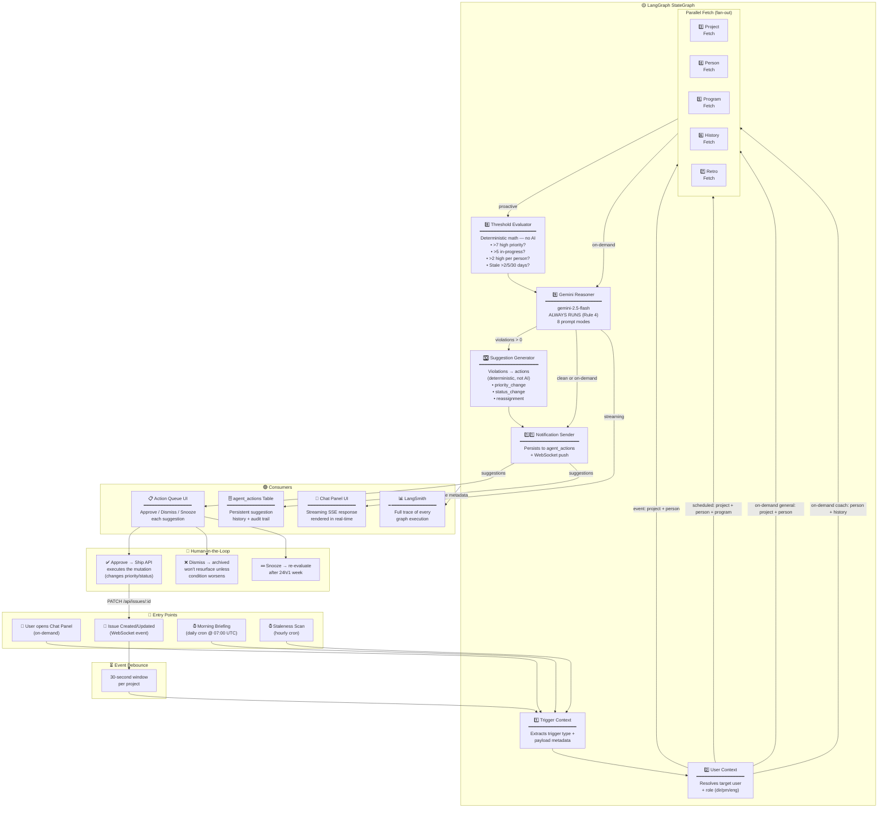
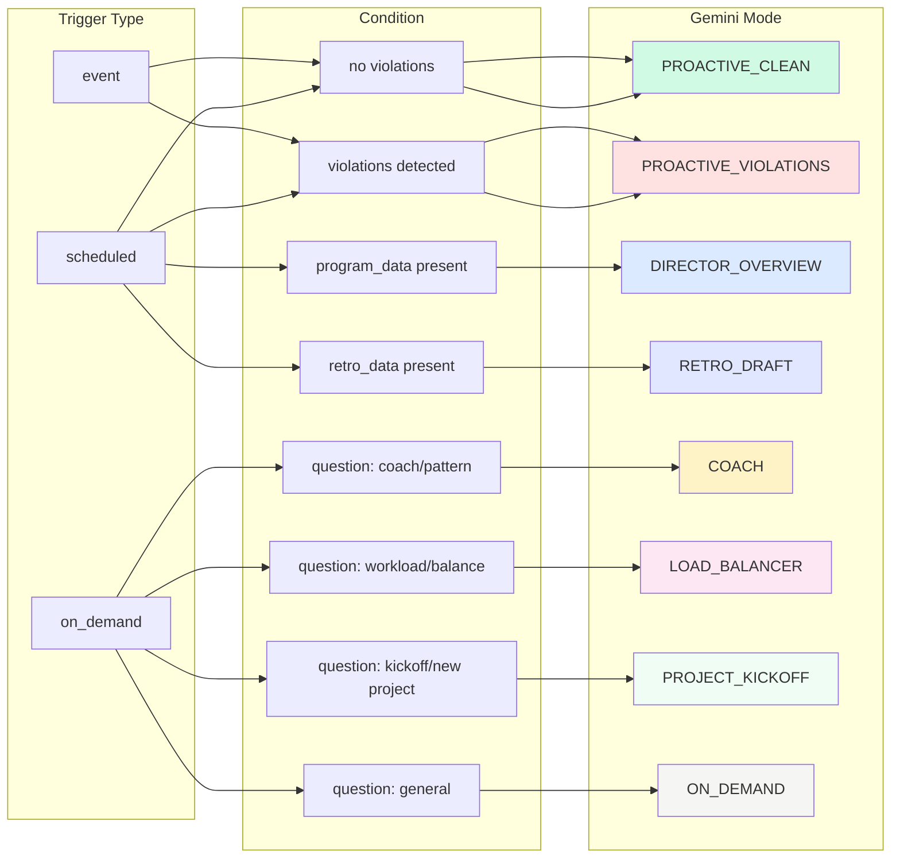

# FleetGraph — System Flowchart

## Full System: Entry Points → Graph → Consumers

```mermaid
flowchart TD
    subgraph ENTRY["🔵 Entry Points"]
        E1["👤 User opens Chat Panel<br/>(on-demand)"]
        E2["📝 Issue Created/Updated<br/>(WebSocket event)"]
        E3["⏰ Morning Briefing<br/>(daily cron @ 07:00 UTC)"]
        E4["⏰ Staleness Scan<br/>(hourly cron)"]
    end

    subgraph DEBOUNCE["⏳ Event Debounce"]
        DB["30-second window<br/>per project"]
    end

    E1 --> TC
    E2 --> DB --> TC
    E3 --> TC
    E4 --> TC

    subgraph GRAPH["🟡 LangGraph StateGraph"]

        TC["1️⃣ Trigger Context<br/>━━━━━━━━━━━━━━━━━<br/>Extracts trigger type +<br/>payload metadata"]

        UC["2️⃣ User Context<br/>━━━━━━━━━━━━━━━━━<br/>Resolves target user<br/>+ role (dir/pm/eng)"]

        TC --> UC

        subgraph FETCH["Parallel Fetch (fan-out)"]
            direction LR
            PF["3️⃣ Project<br/>Fetch"]
            PeF["4️⃣ Person<br/>Fetch"]
            PrF["5️⃣ Program<br/>Fetch"]
            HF["6️⃣ History<br/>Fetch"]
            RF["7️⃣ Retro<br/>Fetch"]
        end

        UC -->|"event: project + person"| FETCH
        UC -->|"scheduled: project + person + program"| FETCH
        UC -->|"on-demand general: project + person"| FETCH
        UC -->|"on-demand coach: person + history"| FETCH

        TE["8️⃣ Threshold Evaluator<br/>━━━━━━━━━━━━━━━━━━━━<br/>Deterministic math — no AI<br/>• >7 high priority?<br/>• >5 in-progress?<br/>• >2 high per person?<br/>• Stale >2/5/30 days?"]

        GR["9️⃣ Gemini Reasoner<br/>━━━━━━━━━━━━━━━━━━━━<br/>gemini-2.5-flash<br/>ALWAYS RUNS (Rule 4)<br/>8 prompt modes"]

        FETCH -->|"proactive"| TE
        FETCH -->|"on-demand"| GR
        TE --> GR

        SG["🔟 Suggestion Generator<br/>━━━━━━━━━━━━━━━━━━━━━<br/>Violations → actions<br/>(deterministic, not AI)<br/>• priority_change<br/>• status_change<br/>• reassignment"]

        NS["1️⃣1️⃣ Notification Sender<br/>━━━━━━━━━━━━━━━━━━━━━<br/>Persists to agent_actions<br/>+ WebSocket push"]

        GR -->|"violations > 0"| SG
        GR -->|"clean or on-demand"| NS
        SG --> NS
    end

    subgraph CONSUMERS["🟢 Consumers"]
        C1["📋 Action Queue UI<br/>━━━━━━━━━━━━━━━━━<br/>Approve / Dismiss / Snooze<br/>each suggestion"]
        C2["💬 Chat Panel UI<br/>━━━━━━━━━━━━━━━━━<br/>Streaming SSE response<br/>rendered in real-time"]
        C3["🗄️ agent_actions Table<br/>━━━━━━━━━━━━━━━━━<br/>Persistent suggestion<br/>history + audit trail"]
        C4["📊 LangSmith<br/>━━━━━━━━━━━━━━━━━<br/>Full trace of every<br/>graph execution"]
    end

    NS -->|"suggestions"| C1
    NS -->|"suggestions"| C3
    GR -->|"streaming"| C2
    GRAPH -->|"trace metadata"| C4

    subgraph HITL["🔴 Human-in-the-Loop"]
        A1["✅ Approve → Ship API<br/>executes the mutation<br/>(changes priority/status)"]
        A2["❌ Dismiss → archived<br/>won't resurface unless<br/>condition worsens"]
        A3["💤 Snooze → re-evaluate<br/>after 24h/1 week"]
    end

    C1 --> A1
    C1 --> A2
    C1 --> A3
    A1 -->|"PATCH /api/issues/:id"| E2
```

## Gemini Mode Selection

```mermaid
flowchart LR
    subgraph TRIGGER["Trigger Type"]
        T1["event"]
        T2["scheduled"]
        T3["on_demand"]
    end

    subgraph CONDITION["Condition"]
        V0["no violations"]
        V1["violations detected"]
        PD["program_data present"]
        RD["retro_data present"]
        QC["question: coach/pattern"]
        QL["question: workload/balance"]
        QK["question: kickoff/new project"]
        QG["question: general"]
    end

    subgraph MODE["Gemini Mode"]
        M1["PROACTIVE_CLEAN"]
        M2["PROACTIVE_VIOLATIONS"]
        M3["DIRECTOR_OVERVIEW"]
        M4["RETRO_DRAFT"]
        M5["COACH"]
        M6["LOAD_BALANCER"]
        M7["PROJECT_KICKOFF"]
        M8["ON_DEMAND"]
    end

    T1 --> V0 --> M1
    T1 --> V1 --> M2
    T2 --> PD --> M3
    T2 --> RD --> M4
    T2 --> V1 --> M2
    T2 --> V0 --> M1
    T3 --> QC --> M5
    T3 --> QL --> M6
    T3 --> QK --> M7
    T3 --> QG --> M8

    style M1 fill:#d1fae5
    style M2 fill:#fee2e2
    style M3 fill:#dbeafe
    style M4 fill:#e0e7ff
    style M5 fill:#fef3c7
    style M6 fill:#fce7f3
    style M7 fill:#f0fdf4
    style M8 fill:#f5f5f4
```

## Feedback Loop: Approve → Mutation → Event → Re-evaluation

```mermaid
flowchart LR
    A["Agent detects<br/>9 high-priority<br/>issues"] --> S["Suggests: demote<br/>issue #11 to<br/>medium priority"]
    S --> Q["Action Queue:<br/>user sees card"]
    Q -->|"Approve"| M["Ship API:<br/>PATCH /api/issues/11<br/>priority → medium"]
    M --> WS["WebSocket:<br/>issue:updated<br/>event fired"]
    WS --> DB["30s debounce"]
    DB --> R["Agent re-evaluates:<br/>now 8 high-priority<br/>(still over threshold)"]
    R --> S2["New suggestion:<br/>demote issue #6"]

    style A fill:#fee2e2
    style S fill:#fef3c7
    style Q fill:#dbeafe
    style M fill:#d1fae5
    style WS fill:#e0e7ff
    style R fill:#fee2e2
    style S2 fill:#fef3c7
```
