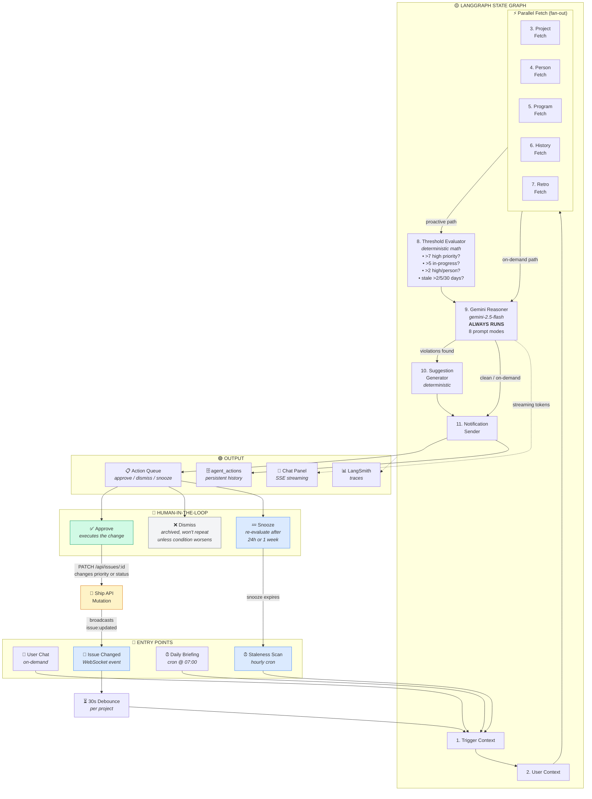
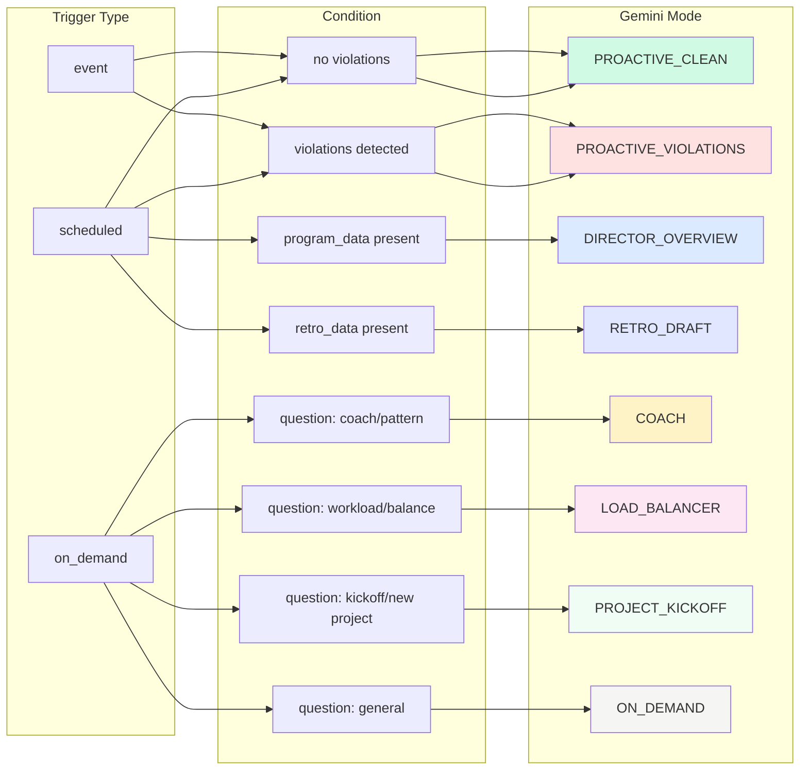

# FleetGraph — System Flowchart

## The Agent Loop

The FleetGraph agent is a continuous loop, not a one-shot pipeline. There are three ways the loop re-enters:

1. **Proactive loop**: Issue mutation → WebSocket event → debounce → graph run → suggestion → user approves → Ship API mutation → WebSocket event → graph re-evaluates
2. **Scheduled loop**: Cron fires → graph run → surfaces new violations → user acts → mutations trigger proactive loop
3. **Command loop**: User types command in chat (e.g. "run a health check") → full graph runs with thresholds + suggestions → results stream into chat with inline actions → user approves → mutation → proactive loop

### On-Demand: Chat vs Command

Regular chat questions ("how is this project?") stream Gemini directly — no thresholds, no suggestions.

Command questions trigger the full proactive pipeline inside the chat:

| Command | What Runs |
|---------|-----------|
| "Run a health check on this project" | Fetch → Threshold → Gemini → Suggestions |
| "Give me my morning briefing" | ProgramFetch → Threshold → Gemini DIRECTOR_OVERVIEW |
| "Check for stale issues" | Fetch → Threshold (staleness) → Gemini → Suggestions |
| "Scan all programs for risk" | ProgramFetch → Threshold per project → Gemini DIRECTOR_OVERVIEW |



## Gemini Mode Selection



## The Loop in Plain English

```
┌─────────────────────────────────────────────────────────┐
│                                                         │
│  ENTRY: Issue changes in Ship (or cron fires)           │
│    ↓                                                    │
│  DEBOUNCE: 30 seconds per project                       │
│    ↓                                                    │
│  FETCH: Get project issues + person workload            │
│    ↓                                                    │
│  EVALUATE: Check thresholds (deterministic, no AI)      │
│    ↓                                                    │
│  REASON: Gemini 2.5 Flash analyzes (always runs)        │
│    ↓                                                    │
│  SUGGEST: Map violations → concrete actions             │
│    ↓                                                    │
│  PERSIST: Write to agent_actions + notify user          │
│    ↓                                                    │
│  HUMAN: User sees suggestion → Approve / Dismiss / Snooze│
│    ↓                                                    │
│  IF APPROVE: Ship API patches the issue                 │
│    ↓                                                    │
│  LOOP: Mutation fires WebSocket event → back to top     │
│                                                         │
└─────────────────────────────────────────────────────────┘
```

The agent never stops. Proactive mode loops through events continuously. Scheduled mode adds periodic sweeps. On-demand mode is a user-initiated single pass through the graph that returns a streaming response.
