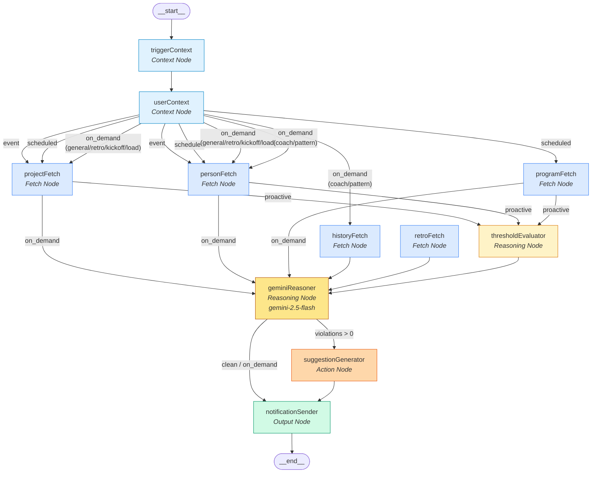

# FleetGraph — Graph Agent Architecture Visual

## Compiled Graph: All Nodes and Edges



## Node Inventory (11 nodes)

| # | Node | Type | Purpose | Error Handling |
|---|------|------|---------|----------------|
| 1 | `triggerContext` | Context | Extracts trigger metadata (event/scheduled/on_demand payload) | Passes through |
| 2 | `userContext` | Context | Resolves target user ID and role (director/pm/engineer) | Defaults to engineer |
| 3 | `projectFetch` | Fetch | Gets project + issues from Ship API via `ShipClient` | Catches errors → `state.errors` |
| 4 | `personFetch` | Fetch | Gets all issues assigned to target user | Catches errors → `state.errors` |
| 5 | `programFetch` | Fetch | Gets all programs + projects (director overview) | Catches errors → `state.errors`, partial failure continues |
| 6 | `historyFetch` | Fetch | Gets past agent_actions for coach pattern detection | Catches errors → `state.errors` |
| 7 | `retroFetch` | Fetch | Splits project issues into completed vs carryover | Catches errors → `state.errors` |
| 8 | `thresholdEvaluator` | Reasoning | Deterministic math — checks priority/WIP/staleness thresholds | Never throws (pure function) |
| 9 | `geminiReasoner` | Reasoning | AI analysis via Gemini 2.5 Flash (8 modes) | Catches errors → structured fallback |
| 10 | `suggestionGenerator` | Action | Maps violations → concrete suggestions deterministically | Never throws |
| 11 | `notificationSender` | Output | Persists to agent_actions + WebSocket push | Catches per-suggestion errors |

## Gemini Modes (8 modes)

| Mode | Trigger | System Prompt | Used When |
|------|---------|--------------|-----------|
| `PROACTIVE_CLEAN` | event/scheduled | Health summary in 2-3 sentences | No violations detected |
| `PROACTIVE_VIOLATIONS` | event/scheduled | Root cause + risk + recommendation per violation | Violations detected |
| `ON_DEMAND` | on_demand | Answer user's question with issue data | General question |
| `DIRECTOR_OVERVIEW` | scheduled | Rank projects by risk across portfolio | Scheduled + program_data present |
| `COACH` | on_demand | Analyze work patterns, trends, recommendations | Question mentions "pattern"/"trend"/"coach" |
| `RETRO_DRAFT` | scheduled/on_demand | Draft retrospective (went well / carried over / velocity) | Retro data present or question asks for retro |
| `LOAD_BALANCER` | on_demand | Compare workload, suggest reassignments | Question mentions "workload"/"balance"/"reassign" |
| `PROJECT_KICKOFF` | on_demand | Evaluate orphaned issues for new project | Question mentions "new project"/"kickoff"/"orphan" |

## Execution Paths

### Path 1: Proactive Event (Clean)
```
START → triggerContext → userContext → [projectFetch ∥ personFetch]
  → thresholdEvaluator (0 violations) → geminiReasoner (PROACTIVE_CLEAN)
  → notificationSender → END
```

### Path 2: Proactive Event (Violations)
```
START → triggerContext → userContext → [projectFetch ∥ personFetch]
  → thresholdEvaluator (violations) → geminiReasoner (PROACTIVE_VIOLATIONS)
  → suggestionGenerator → notificationSender → END
```

### Path 3: On-Demand General
```
START → triggerContext → userContext → [projectFetch ∥ personFetch]
  → geminiReasoner (ON_DEMAND) → notificationSender → END
```

### Path 4: Director Overview (Scheduled)
```
START → triggerContext → userContext → [projectFetch ∥ personFetch ∥ programFetch]
  → thresholdEvaluator → geminiReasoner (DIRECTOR_OVERVIEW)
  → notificationSender → END
```

### Path 5: Coach (On-Demand)
```
START → triggerContext → userContext → [personFetch ∥ historyFetch]
  → geminiReasoner (COACH) → notificationSender → END
```

### Path 6: Load Balancer (On-Demand)
```
START → triggerContext → userContext → [projectFetch ∥ personFetch]
  → geminiReasoner (LOAD_BALANCER) → notificationSender → END
```

### Path 7: Gemini Failure (Fallback)
```
START → triggerContext → userContext → [projectFetch ∥ personFetch]
  → thresholdEvaluator (violations) → geminiReasoner (ERROR → structured fallback)
  → suggestionGenerator → notificationSender → END
```
